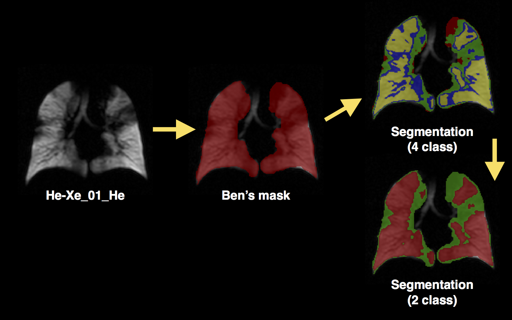
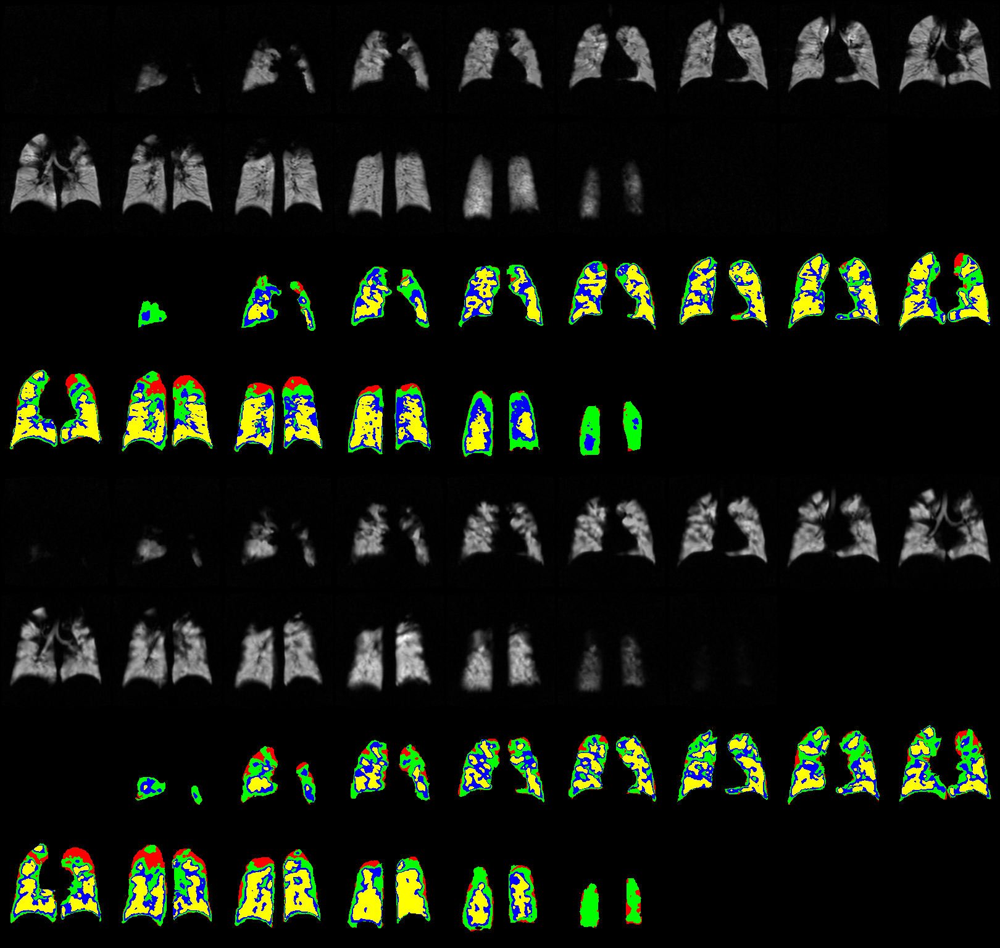
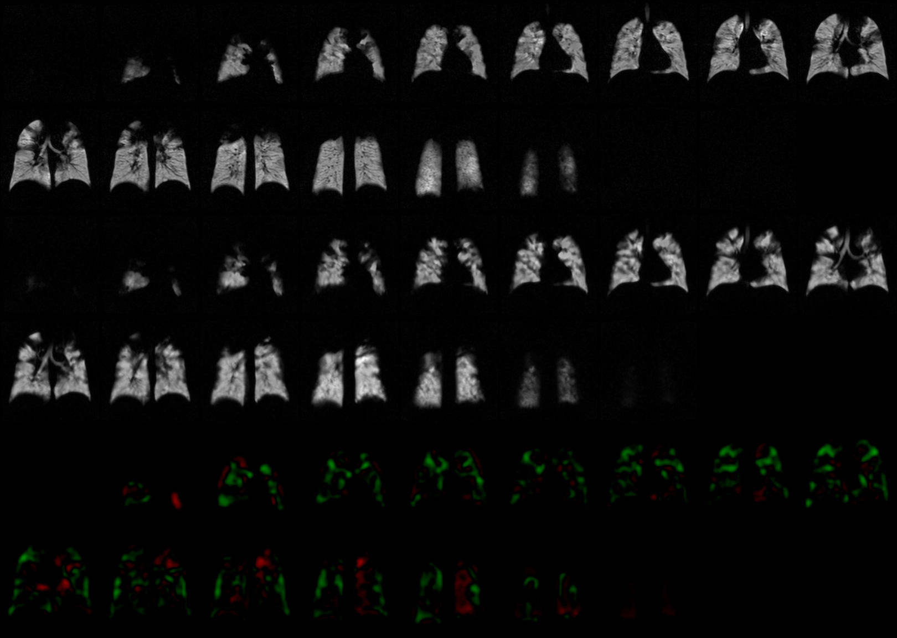
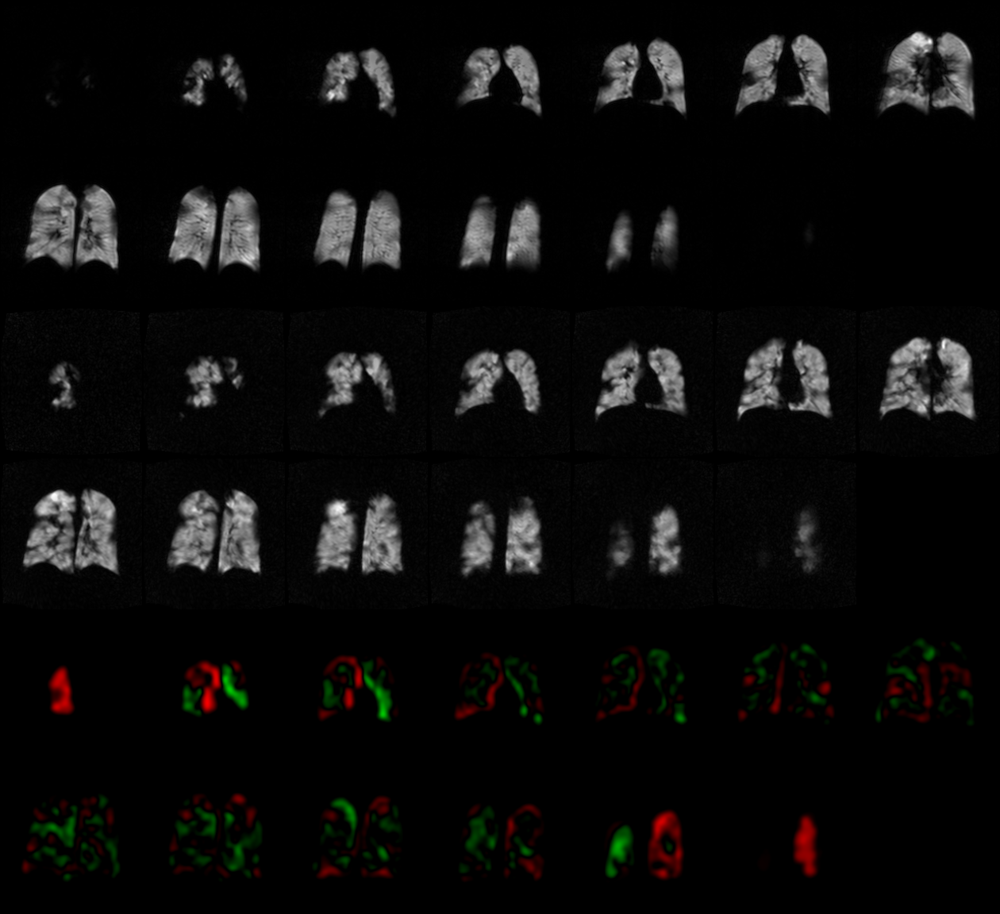
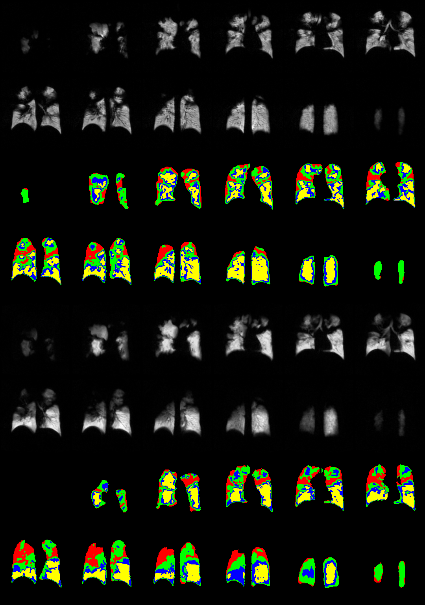
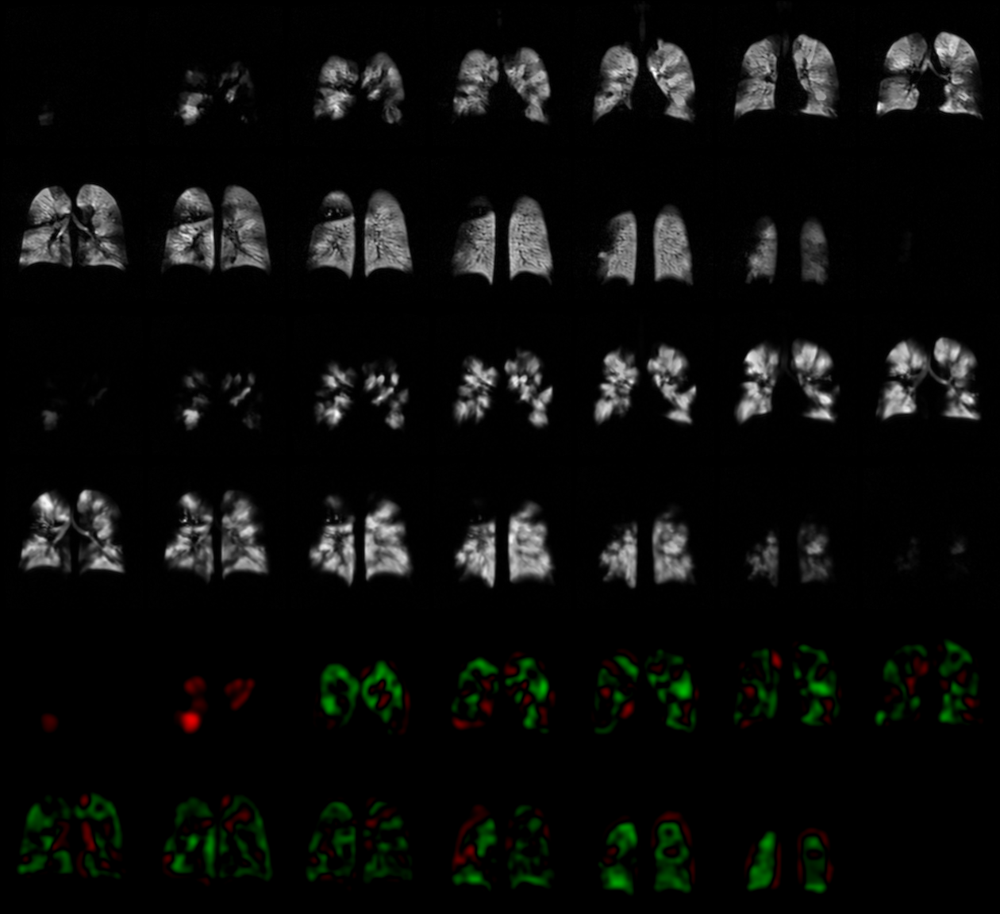
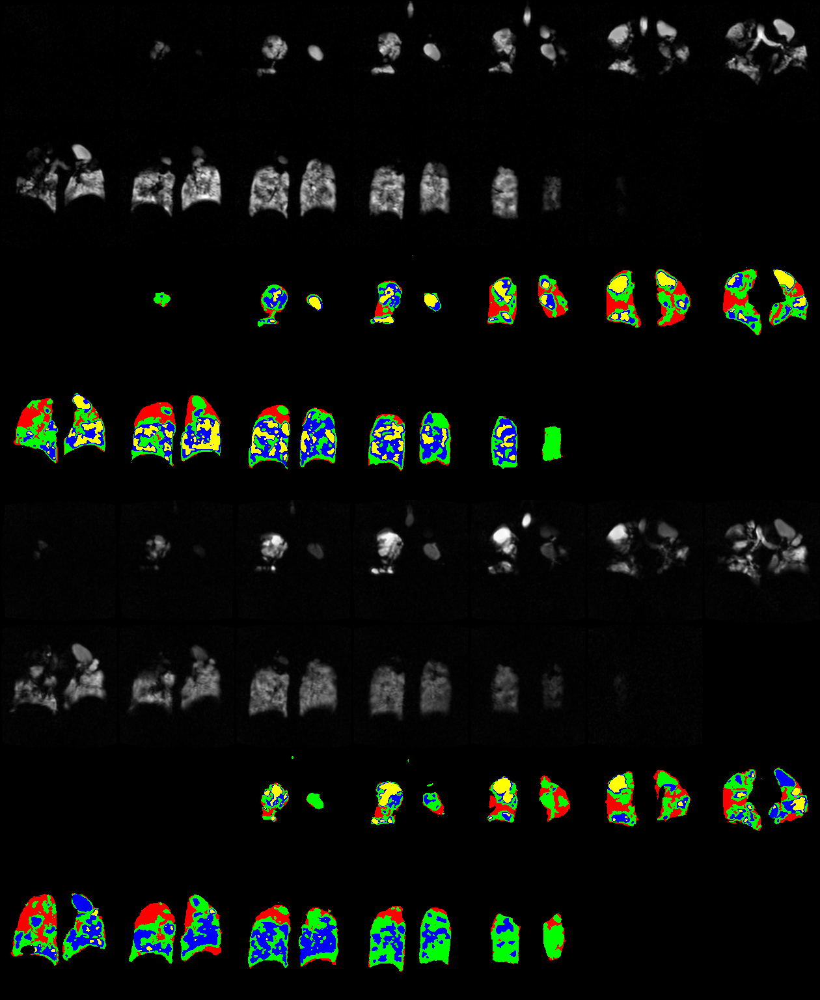
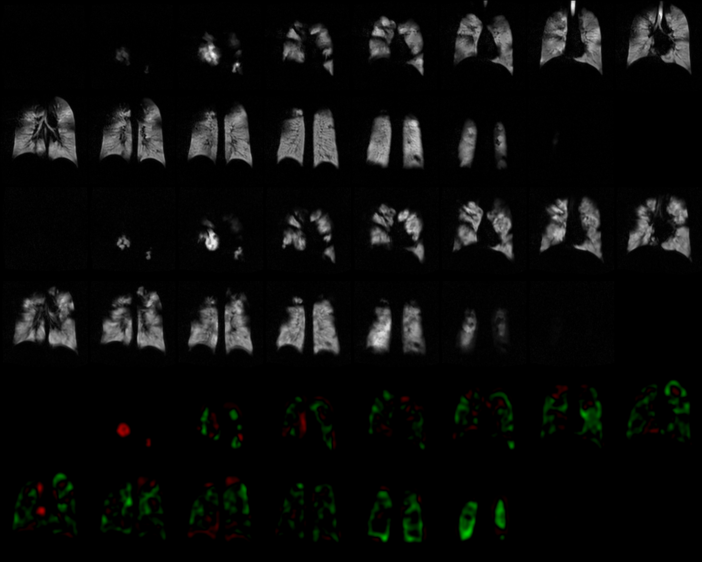

## "Hello" from sunny California


# Ventilation segmentation

## Background

- no image registration was used for these results
- Ben and Alicia provided lung masks (Ben was the default)
- Redid the analysis for all subjects on August 19 to take advantage of accumulated updates to analysis pipeline

## Analysis pipeline



## Total volumes

Volume of Ben's (or Alicia's) mask in $mm^3$

```{r,results = 'asis', echo = FALSE}
results <- read.csv( "./data/resultsNew.csv" )
results <- results[,c(1,2,5)];
pandoc.table( results, style = "rmarkdown", split.tables = Inf )
```

## Defect volume ratio
Defect volume ratio = green region in 2-class segmentation / total volume
```{r,results = 'asis', echo = FALSE}
results <- read.csv( "./data/resultsNew.csv" )
pandoc.table( results[,c(1,3,6)], style = "rmarkdown", split.tables = Inf )
ttest <- t.test( results[,3], results[,6], paired = TRUE, alternative = "two.sided" )
cat( "p-value = ", ttest$p.value, "\n", sep = '' )
cat( "\n mean of the differences = ", ttest$estimate, "\n", sep = '' )
```

## Expected ventilation
Expected ventilation = $f$(probabilities of all 4 segmentation classes)
(How well is the lung ventilated?  1 = not well ventilated ... 4 = well-ventilated)
```{r,results = 'asis', echo = FALSE}
results <- read.csv( "./data/resultsNew.csv" )
pandoc.table( results[,c(1,4,7)], style = "rmarkdown", split.tables = Inf )
ttest <- t.test( results[,4], results[,7], paired = TRUE, alternative = "two.sided" )
cat( "p-value = ", ttest$p.value, "\n", sep = '' )
cat( "\n mean of the differences = ", ttest$estimate, "\n", sep = '' )
```

# Individual subject images

## Background

- For each subject, we registered the Xenon image to its Helium counterpart.
- That transform, $\mathcal{T}$, was used to warp the Xenon expected ventilation (EV) image to the space of the Helium image.
- The difference image was calculated: $(He_{EV} - \mathcal{T}(Xe_{EV}))$.

## A couple additional notes:

- Christmas tree maps require image registration (unlike the ventilation segmentation).
- I would be inclined to avoid registration-based analyses for these data as the registration
problem is ill-posed (don't worry, Tally, there are plenty of other data for which we can
have Christmas tree maps such as Novartis):
    * Only lung masks are used to register He/Xe pairs (_cannot_ use ventilation images).
    * Lung masks do not provide internal anatomy (e.g., airways).
    * Lung masks are of significantly poorer quality than we are using for other projects (using
    H1 images and an automated segmentation protocol).
- Hyper-intense spots cause segmentation problems (e.g., He-Xe_06_Xe0219, He_Xe_12_Xe_0244) so
comparison is difficult.

## Guide for the slides:

- First slide for each subject is the bias corrected + segmentation images.
- Each subject is identified by the Xe acquisition numbers although both Xe and He images are on each slide.
- Helium on top, Xenon (warped to Helium) on bottom.
- Second slice for each subject are the following images:
    * Bias corrected Helium image.
    * Bias corrected, transformed Xenon image.
    * Christmas tree maps from the difference image after smoothing:  $(He_{EV} - \mathcal{T}(Xe_{EV}))$.


## He-Xe_01_Xe


## He-Xe_01_Xe


## He-Xe_03_Xe_0206


## He-Xe_03_Xe_0206


## He-Xe_04_Xe_0213


## He-Xe_04_Xe_0213


## He-Xe_05_Xe_0217


## He-Xe_05_Xe_0217


## He-Xe_06_Xe0219


## He-Xe_06_Xe0219$^*$


$^*$Bright spots cause large segmentation differences.

## He-Xe_07_Xe_0220


## He-Xe_07_Xe_0220


## He_Xe_01_Xe_0242


## He_Xe_01_Xe_0242


## He_Xe_09_Xe_0227


## He_Xe_09_Xe_0227


## He_Xe_10_Xe_0236


## He_Xe_10_Xe_0236


## He_Xe_11_Xe_0238


## He_Xe_11_Xe_0238


## He_Xe_12_Xe_0244$^*$


$^*$Bright spots cause large segmentation differences.

## He_Xe_12_Xe_0244


## Xe\#390


## Xe\#390


## Xe\#392


## Xe\#392


## Xe\#394


## Xe\#394


## Xe\#402


## Xe\#402


